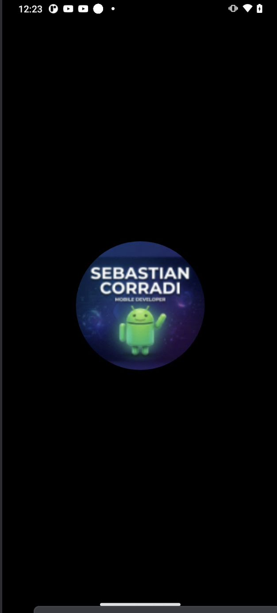
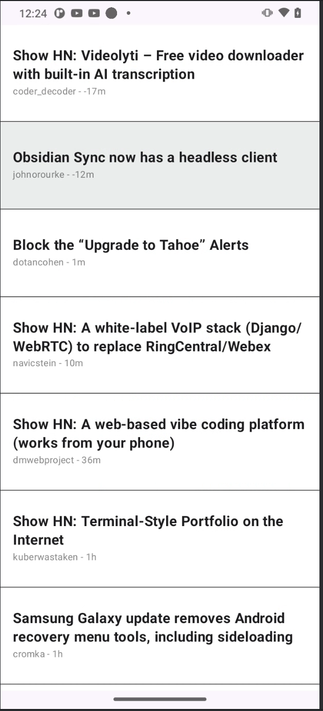
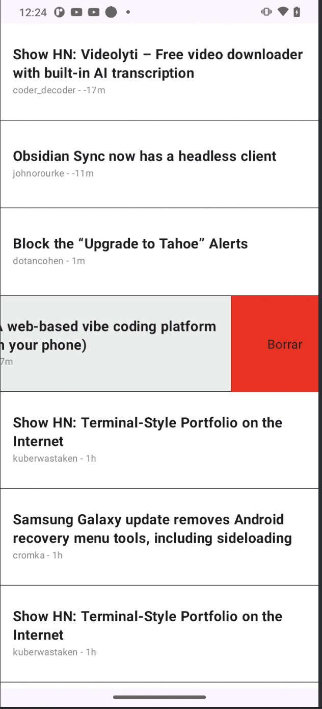

# Mobile Developer Test
# By Sebastian Corradi 
# SebastianCorradi@gmail.com

## For ApplyDigital

### Description
This is an Android application developed with a focus on modern development practices, clean architecture, and reactive UI using Jetpack Compose.

### How to Run the App

#### Prerequisites
* **Android Studio Ladybug (2024.2.1) or newer**: The project uses modern Gradle features and Kotlin 2.0.21, which require a recent version of Android Studio.
* **JDK 17**: Ensure your Android Studio is configured to use JDK 17 for building the project (Settings > Build, Execution, Deployment > Build Tools > Gradle > Gradle JDK).
* **Internet Connection**: Required for the first build to download dependencies and for the app to fetch the initial data from the API.

#### Steps to Run
1.  **Clone the repository**:
    ```bash
    git clone https://github.com/CorradiSebastian/applyDigital.git
    ```
2.  **Open the project**:
    Launch Android Studio and select "Open" to navigate to the project's root folder.
3.  **Gradle Sync**:
    Wait for the automatic Gradle synchronization to complete. This will download all necessary libraries, including Room, Retrofit, Hilt, and Compose.
4.  **Run the App**:
    Connect an Android device (Physical or Emulator) with **API Level 29 (Android 10) or higher** and click the "Run" button in Android Studio.

### Architecture & Pattern
The project follows **Clean Architecture** principles combined with the **MVVM (Model-View-ViewModel)** pattern:
*   **Domain Layer**: Contains the core business logic, entities, and Use Case definitions. It is independent of other layers.
*   **Data Layer**: Responsible for data operations, including API calls (Retrofit) and local persistence (Room). It implements the repository interfaces defined in the Domain layer.
*   **Presentation Layer**: Built with **Jetpack Compose**. It uses ViewModels to observe state changes via `StateFlow` and handle user interactions.

### Key Features & Tools
*   **Offline Support**: Implemented using **Room**. The app follows a "Network-First" strategy, caching data locally to remain functional without internet.
*   **Dependency Injection**: Powered by **Hilt** (Dagger) for robust and testable code.
*   **Network**: **Retrofit** and **OkHttp** for efficient API communication.
*   **Modern UI**: 
    *   **Jetpack Compose** for a fully declarative UI.
    *   **Material 3** components and theming.
    *   **Swipe-to-Dismiss**: Integrated into the list for intuitive item deletion.
    *   **Pull-to-Refresh**: Using Material 3's `PullToRefreshBox`.
    *   **Splash Screen**: Implemented with the `androidx.core:core-splashscreen` API for a seamless startup experience.
*   **Build System**: Kotlin DSL (`build.gradle.kts`) and Version Catalog (`libs.versions.toml`) for better dependency management.

### Assumptions & Notes
*   The project uses **KSP** (Kotlin Symbol Processing) instead of Kapt where possible (e.g., Room) for faster build times.
*   The minimum supported Android version is **API 29**, covering the vast majority of active devices.
*   The app assumes the API endpoint is stable and available.
*   When an "Article" time stamp is "in the future" It will be show anyway and also will be sorted.
*   No specific error are handled
*   No logic was added to avoid multiple operations at the same time ("Pull to refresh" and "delete item")
*   Item and description in de "swipe to delete" animation is slightly different.
*   Articles in the UI might be slightly different too, because the lack of a figma or more specific details 
*   No tests were requested, so no tests were added.

<div style="display: flex; justify-content: space-around; align-items: center;">
  
  
  
</div>
